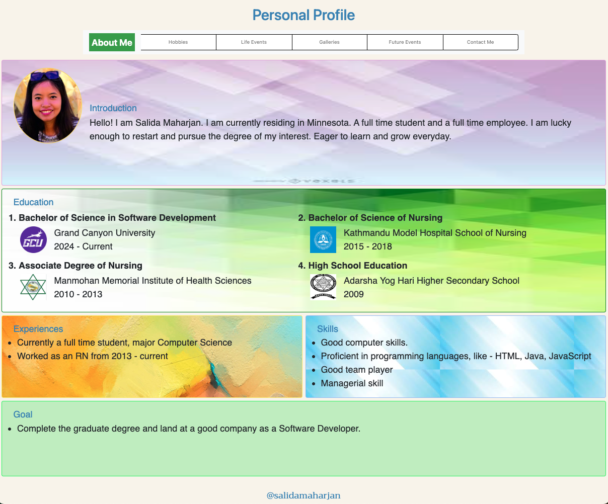

# Personal Profile

Personal Profile is a website which lets you know more about me.

## Description

This website is created using HTML (Hypertext markup Language), internal CSS(Cascading Style sheet), JavaScript language, Bootstrap CSS framework and jQuery. The landing page of the website is About Me section where you can find my introduction, education background, skills, experiences and goal as follows:

- The viewer can click on tabs.
- The viewer can find the link on the hobbies page when clicked on an alert message pops up.
- If the user clicks `Yes` that leads to Galleries tab and could find the related videos and pictures.
- The viewer can hover on the name of places visited on the LifeEvents page which shows the image of the place. You can see change in text color when hovered.
- The user can find the link which opens on the new tabs to give more details about the place.
- The color of the visited link change to blue.
- The website has responsive UI.

## Table of Content

1. Installation
2. Usage
3. Credits
4. Future Development

## Installation

- Visual Studio Code(VS Code IDE)

## Usage

- View the about me section when entered `http://127.0.0.1:5500/Topic1/personalProfile/aboutMe.html`

## Credits

- GCU CST-120 course work
- [W3Schools](https://www.w3schools.com/html/)
- [SoloLearn Activity](https://www.sololearn.com/en/learn)
- [JavaScript](https://www.w3schools.com/js/js_whereto.asp)
- [Bootstrap](https://getbootstrap.com/docs/4.1/components/navbar/)
- [jQuery](https://www.w3schools.com/JQuery/jquery_selectors.asp)
- Class Discussion

## Future Development

- Add downloadable Resume.
